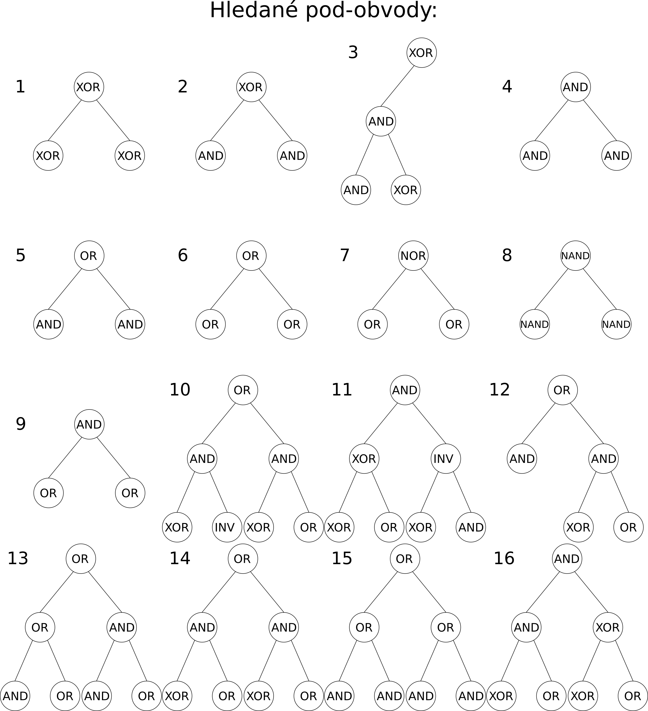
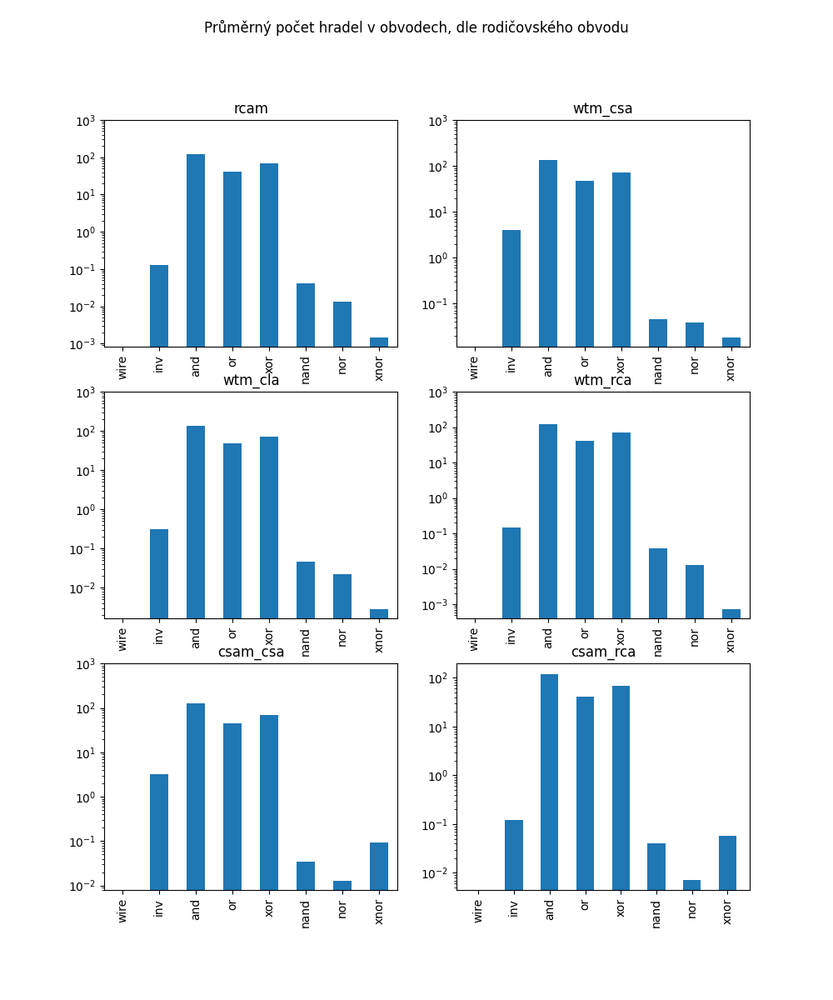
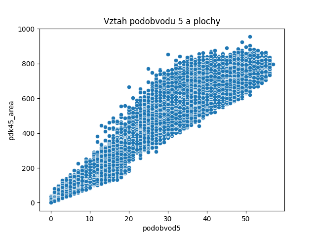

# Analysis of approximate circuits created by evolutionary algorithm
Vysledky klasifikace

Vizualizace hledanych obvodu

Pocet vyskytu techto podobvodu v obvodech dle rodice z pocatecni populace

Vztah poctu vyksytu podobvodu cislo 5 a plochy daneho obvodu

